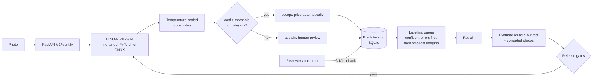
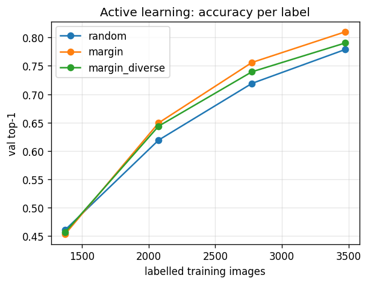

# Item Identifier — fine-grained visual identification that knows when it is unsure

[](https://github.com/manojrevenkar12-web/item-identifier/actions/workflows/ci.yml) [](LICENSE) [](https://colab.research.google.com/github/manojrevenkar12-web/item-identifier/blob/main/notebooks/train_stanford_cars_colab.ipynb)

> **Results on 8,041 held-out images (Stanford Cars, 196 classes):** 90.6% top-1 · calibration error 0.230 → 0.021 · 80.6% of photos auto-identified at 95.9% precision, the rest routed to human review · uncertainty sampling needs ~20% fewer labels than random. [Full results ↓](#results)


A production-oriented computer-vision system that identifies an exact item (here: one of 196 car
make/model/year classes in Stanford Cars) from a photo, returns a **calibrated** confidence, and
**abstains** when that confidence is below a per-category threshold tuned to a business precision
target. Every abstention and every human correction feeds an error-driven labelling queue, and no
model ships unless it passes absolute and no-regression quality gates in CI.

The use case it is built for: a resale marketplace where a wrong identification means a wrong price.
There, "95% accurate" is less useful than "when we auto-accept, we are right ≥ 95% of the time, and we
auto-accept X% of traffic".



## What is in here

| Area | What it does | Code |
|---|---|---|
| Fine-tuning | DINOv2 ViT-S/14 (or any timm backbone) with frozen-backbone warm-up, then end-to-end fine-tuning with a 50× lower backbone LR; AMP, cosine schedule, early stopping | `train.py`, `model.py` |
| CNN baseline | ResNet-50 on the same pipeline for an apples-to-apples comparison | `configs/baseline_resnet50.yaml` |
| Calibration | Temperature scaling fitted on validation; ECE, NLL, Brier, reliability diagram | `calibration.py` |
| Abstention | Lowest threshold that meets the precision target, per category with a global fallback; fails closed (accept nothing) if the target is unreachable; ties never split | `selective.py` |
| Evaluation | Top-1/5, macro accuracy, per-category accuracy/coverage/precision, within- vs cross-category error split, top confusions, risk–coverage curve (AURC), HTML report | `evaluate.py` |
| Robustness | Evaluation on corrupted test copies (motion blur, JPEG, noise, pixelation, contrast) to approximate phone photos | `scripts/prepare_stanford_cars.py --robustness` |
| Active learning | Pool-based simulation comparing random, least-confidence, margin, entropy and margin + k-center diversity sampling; learning curves | `active_learning.py` |
| Prioritisation | Combines per-category quality with live traffic into automation gap and error exposure, and recommends "expand coverage" vs "improve accuracy" | `prioritize.py` |
| Serving | FastAPI: identify, feedback, labelling queue, traffic, model info, health/readiness, Prometheus metrics; upload size and decompression-bomb limits | `serving/` |
| Export & latency | ONNX export with numerical parity check; batch-1 CPU p50/p95/p99 benchmark | `export.py` |
| Release gates | Absolute bars (accuracy, ECE, coverage, precision holds on test, p95 latency) and regression bars vs baseline (global and per-category) | `gates.py` |
| Delivery | Docker (non-root, health check), GitHub Actions (lint, 22 tests, full pipeline + gates on every PR, image build) | `Dockerfile`, `.github/workflows/ci.yml` |
| Results | Real evaluation reports, robustness, active-learning curves | `results/` |

## Results

Stanford Cars, 196 classes / 49 makes, **8,041 held-out test images**. Trained on a Colab T4 with
`notebooks/train_stanford_cars_colab.ipynb` (15 epochs, ~100 s/epoch). Temperature and abstention
thresholds are fitted on the validation split and **measured** on the untouched test split. Raw reports
(JSON + HTML with reliability and risk–coverage plots) are in [`results/`](results/).

| Model | Top-1 | Top-5 | ECE raw → calibrated | Auto-accept coverage | Precision when accepted (target 95%) | AURC |
|---|---|---|---|---|---|---|
| **DINOv2 ViT-S/14** | **90.6%** | 98.0% | 0.230 → **0.021** | **80.6%** (6,479 / 8,041) | **95.9%** | 0.022 |
| ResNet-50 (same recipe) | 67.7% | 89.4% | 0.206 → 0.010 | 37.9% (3,050 / 8,041) | 94.5% | 0.115 |

What this means for a pricing workflow: with the DINOv2 model, 4 in 5 photos are identified
automatically, and those auto-accepted answers are right 95.9% of the time; the remaining 1 in 5 go to
human review. Calibration cut the confidence error by 11× without changing accuracy.

Notes on the comparison:
- The ResNet-50 uses the identical 15-epoch recipe; it is **not** separately tuned (well-tuned ResNet-50s
  reach ~90% on this dataset). The comparison shows how much more the DINOv2 features give under a
  fixed, small training budget, not that CNNs are worse in general.
- Of DINOv2's 760 test errors, 411 are confusions inside the same make (e.g. Audi TTS Coupe 2012 vs
  Audi TT Hatchback 2011, Dodge Caliber Wagon 2012 vs 2007), i.e. genuinely look-alike items.

**Per-category view.** Accuracy ranges from 78.8% (Audi, 22 models) to 100% (Tesla, smart, Plymouth).
Audi is the clearest priority: auto-accept coverage there is only 16% because its per-category
threshold has to be strict to keep 95% precision. `itemid prioritize` flags it first.

### Robustness (DINOv2, corrupted copies of the test set)

| Test set | Top-1 | ECE | Coverage | Precision when accepted |
|---|---|---|---|---|
| Clean | 90.6% | 0.021 | 80.6% | 95.9% |
| JPEG compression | 90.3% | 0.020 | 80.3% | 95.9% |
| Contrast | 90.1% | 0.022 | 79.6% | 95.7% |
| Motion blur | 89.7% | 0.020 | 79.7% | 95.7% |
| Gaussian noise | 88.5% | 0.020 | 77.7% | 95.3% |
| Pixelate | _excluded, under investigation_ | | | |

Calibration and the 95% precision target hold under realistic photo degradation: coverage drops a
little, but precision on accepted answers stays above 95%. The pixelate split scores 2.6%, with
predictions collapsing onto class 0 ("AM General Hummer SUV 2000"). That pattern points to a
data-preparation problem with that split (e.g. very low-resolution source images) rather than a
property of the model, so it is reported here but not counted until it is resolved.

### Active learning (one seed, 20% labelled start, 700 labels per round)



| Labelled images | Random | Margin | Margin + diversity |
|---|---|---|---|
| 1,375 (start) | 46.1% | 45.4% | 45.7% |
| 2,075 | 61.9% | **64.9%** | 64.4% |
| 2,775 | 71.9% | **75.6%** | 74.0% |
| 3,475 | 77.9% | **81.0%** | 79.0% |

Margin-based uncertainty sampling beats random by 3–4 points of validation accuracy at every round;
with 2,775 labels it already passes what random sampling reaches with 3,475, i.e. ~20% fewer labels
for the same accuracy. Adding k-center diversity did not help on this dataset. Single seed, so the
gaps are indicative; repeating with more seeds is the next step.

### Release gates (DINOv2)

| Gate | Result |
|---|---|
| Top-1 ≥ 80% | PASS (90.6%) |
| ECE ≤ 0.05 | PASS (0.021) |
| Coverage at target ≥ 60% | PASS (80.6%) |
| Precision on test ≥ 93% | PASS (95.9%) |
| CPU p95 latency ≤ 150 ms | **FAIL** (293 ms on Colab's shared 2-thread CPU, ONNX Runtime, p50 133 ms) |

The latency gate fails on Colab's CPU (the same model measured 76 ms p95 on a different 2-core machine,
so the hardware matters a lot). The gate is doing its job: this model is not promoted to a
CPU-only deployment until INT8 quantisation or a GPU/higher-core serving target brings p95 under budget.

> Pipeline check on the bundled synthetic dataset (CPU, ResNet-18 from scratch, 6 epochs — exercises
> the code, says nothing about real accuracy): ECE 0.167 → 0.033 after temperature scaling,
> 85% auto-accept coverage, ONNX parity max |Δ| 2e-6.

## Quick start

```bash
pip install -e ".[serve,export,dev]"
pytest                                   # 22 tests, ~2 min on CPU

# Full pipeline on the synthetic dataset (CPU, ~1 min)
itemid synth --out data/synthetic
itemid train    --config configs/smoke.yaml
itemid evaluate --config configs/smoke.yaml --checkpoint runs/smoke/model.pt
itemid export   --checkpoint runs/smoke/model.pt --out runs/smoke/model.onnx
itemid bench    --checkpoint runs/smoke/model.pt --onnx runs/smoke/model.onnx --out runs/smoke/latency.json
itemid gate     --config configs/smoke.yaml --report runs/smoke/report_test.json --latency runs/smoke/latency.json

# Real data (GPU recommended): see notebooks/train_stanford_cars_colab.ipynb
python scripts/prepare_stanford_cars.py --out data/stanford_cars --robustness
itemid train --config configs/stanford_cars.yaml

# Serve
itemid serve --checkpoint runs/cars_dinov2_s/model.pt --onnx runs/cars_dinov2_s/model.onnx
curl -F file=@car.jpg localhost:8000/v1/identify
```

Example response (illustrative values):

```json
{
  "request_id": "3f9c…",
  "label": "BMW M3 Coupe 2012",
  "category": "BMW",
  "confidence": 0.912,
  "threshold": 0.874,
  "decision": "accept",
  "alternatives": [{"label": "BMW M3 Coupe 2012", "probability": 0.912},
                   {"label": "BMW 1 Series Coupe 2012", "probability": 0.041}],
  "margin": 0.871,
  "model_version": "20261012-1405",
  "latency_ms": 41.7
}
```

## Using your own catalog

Put images in `root/{train,val,test}/<item_id>/*.jpg`, optionally add `category_map.json`
(`{"<item_id>": "<category>"}`), copy `configs/stanford_cars.yaml` and point `data.root` at it.
Nothing in the code is car-specific.

## Design decisions

See [`docs/DESIGN.md`](docs/DESIGN.md) for the reasoning behind each choice and the known limitations,
and [`docs/MODEL_CARD.md`](docs/MODEL_CARD.md) for intended use.
