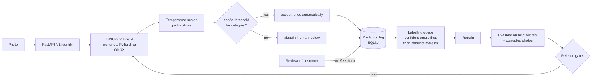

# Item Identifier — fine-grained visual identification that knows when it is unsure

A production-oriented computer-vision system that identifies an exact item (here: one of 196 car
make/model/year classes in Stanford Cars) from a photo, returns a **calibrated** confidence, and
**abstains** when that confidence is below a per-category threshold tuned to a business precision
target. Every abstention and every human correction feeds an error-driven labelling queue, and no
model ships unless it passes absolute and no-regression quality gates in CI.

The use case it is built for: a resale marketplace where a wrong identification means a wrong price.
There, "95% accurate" is less useful than "when we auto-accept, we are right ≥ 95% of the time, and we
auto-accept X% of traffic".



## What is in here

| Area | What it does | Code |
|---|---|---|
| Fine-tuning | DINOv2 ViT-S/14 (or any timm backbone) with frozen-backbone warm-up, then end-to-end fine-tuning with a 50× lower backbone LR; AMP, cosine schedule, early stopping | `train.py`, `model.py` |
| CNN baseline | ResNet-50 on the same pipeline for an apples-to-apples comparison | `configs/baseline_resnet50.yaml` |
| Calibration | Temperature scaling fitted on validation; ECE, NLL, Brier, reliability diagram | `calibration.py` |
| Abstention | Lowest threshold that meets the precision target, per category with a global fallback; fails closed (accept nothing) if the target is unreachable; ties never split | `selective.py` |
| Evaluation | Top-1/5, macro accuracy, per-category accuracy/coverage/precision, within- vs cross-category error split, top confusions, risk–coverage curve (AURC), HTML report | `evaluate.py` |
| Robustness | Evaluation on corrupted test copies (motion blur, JPEG, noise, pixelation, contrast) to approximate phone photos | `scripts/prepare_stanford_cars.py --robustness` |
| Active learning | Pool-based simulation comparing random, least-confidence, margin, entropy and margin + k-center diversity sampling; learning curves | `active_learning.py` |
| Prioritisation | Combines per-category quality with live traffic into automation gap and error exposure, and recommends "expand coverage" vs "improve accuracy" | `prioritize.py` |
| Serving | FastAPI: identify, feedback, labelling queue, traffic, model info, health/readiness, Prometheus metrics; upload size and decompression-bomb limits | `serving/` |
| Export & latency | ONNX export with numerical parity check; batch-1 CPU p50/p95/p99 benchmark | `export.py` |
| Release gates | Absolute bars (accuracy, ECE, coverage, precision holds on test, p95 latency) and regression bars vs baseline (global and per-category) | `gates.py` |
| Delivery | Docker (non-root, health check), GitHub Actions (lint, 22 tests, full pipeline + gates on every PR, image build) | `Dockerfile`, `.github/workflows/ci.yml` |

## Results

Measured on Stanford Cars with `notebooks/train_stanford_cars_colab.ipynb` (Colab T4). Thresholds are
fitted on the validation split and **measured** on the untouched test split.

| Model | Top-1 | Top-5 | ECE raw → calibrated | Auto-accept coverage @ 95% precision | Precision when accepted | CPU p95 (ONNX, 2 threads) |
|---|---|---|---|---|---|---|
| DINOv2 ViT-S/14 | _run notebook_ | | | | | |
| ResNet-50 (baseline) | _run notebook_ | | | | | |

Robustness (DINOv2, top-1 / coverage): clean _–_ · motion blur _–_ · JPEG _–_ · noise _–_ · pixelate _–_

Active learning (labels needed to reach the full-data accuracy): _see `runs/al_cars/al_curve.png`_

> Pipeline check on the bundled synthetic dataset (CPU, ResNet-18 from scratch, 6 epochs — exercises
> the code, says nothing about real accuracy): ECE 0.167 → 0.033 after temperature scaling,
> 85% auto-accept coverage, ONNX parity max |Δ| 2e-6.

## Quick start

```bash
pip install -e ".[serve,export,dev]"
pytest                                   # 22 tests, ~2 min on CPU

# Full pipeline on the synthetic dataset (CPU, ~1 min)
itemid synth --out data/synthetic
itemid train    --config configs/smoke.yaml
itemid evaluate --config configs/smoke.yaml --checkpoint runs/smoke/model.pt
itemid export   --checkpoint runs/smoke/model.pt --out runs/smoke/model.onnx
itemid bench    --checkpoint runs/smoke/model.pt --onnx runs/smoke/model.onnx --out runs/smoke/latency.json
itemid gate     --config configs/smoke.yaml --report runs/smoke/report_test.json --latency runs/smoke/latency.json

# Real data (GPU recommended): see notebooks/train_stanford_cars_colab.ipynb
python scripts/prepare_stanford_cars.py --out data/stanford_cars --robustness
itemid train --config configs/stanford_cars.yaml

# Serve
itemid serve --checkpoint runs/cars_dinov2_s/model.pt --onnx runs/cars_dinov2_s/model.onnx
curl -F file=@car.jpg localhost:8000/v1/identify
```

Example response (illustrative values):

```json
{
  "request_id": "3f9c…",
  "label": "BMW M3 Coupe 2012",
  "category": "BMW",
  "confidence": 0.912,
  "threshold": 0.874,
  "decision": "accept",
  "alternatives": [{"label": "BMW M3 Coupe 2012", "probability": 0.912},
                   {"label": "BMW 1 Series Coupe 2012", "probability": 0.041}],
  "margin": 0.871,
  "model_version": "20261012-1405",
  "latency_ms": 41.7
}
```

## Using your own catalog

Put images in `root/{train,val,test}/<item_id>/*.jpg`, optionally add `category_map.json`
(`{"<item_id>": "<category>"}`), copy `configs/stanford_cars.yaml` and point `data.root` at it.
Nothing in the code is car-specific.

## Design decisions

See [`docs/DESIGN.md`](docs/DESIGN.md) for the reasoning behind each choice and the known limitations,
and [`docs/MODEL_CARD.md`](docs/MODEL_CARD.md) for intended use.
